# PRD: Implementação de Métodos Faltantes e Correções de Nomenclatura

---

## 1. Executive Summary

### Problem Statement
O módulo AztecWPBrowser para testes de WooCommerce possui métodos incompletos em várias traits quando comparado com os padrões estabelecidos pelo Codeception, wp-browser e WPDb. Isso limita a capacidade de escrita de testes mais abrangentes e rompe com a consistência esperada pelos desenvolvedores familiarizados com esses frameworks.

### Proposed Solution
Implementar todos os métodos faltantes identificados no documento de análise (`plans/plano-analise-padroes-codeception.md`), renomear métodos inconsistentes para conformidade com wp-browser, e fornecer especificações de teste para cada novo método.

### Success Criteria

1. **Conformidade**: 100% dos métodos listados como faltantes implementados seguindo padrões Codeception/wp-browser/WPDb
2. **Consistência**: Métodos renomeados para seguir convenções de nomenclatura wp-browser
3. **Cobertura de Testes**: Cada método novo com pelo menos um Cest testando seu funcionamento
4. **Documentação**: Codeception build executa sem erros após mudanças de assinatura

---

## 2. User Experience & Functionality

### User Personas

- **Desenvolvedor de Testes**: Desenvolvedor que escreve acceptance tests para WooCommerce usando Codeception
- **QA Engineer**: Responsável por garantir qualidade de plugins/temas WooCommerce
- **Contribuidor**: Desenvolvedor que contribui com o módulo

---

## 2.1 ProductMethods User Stories

### Story 1.1: Retrieve - Buscar ID de Produto
**Como desenvolvedor de testes, eu quero** `grabProductIdFromDatabase` **para que eu possa** obter o ID de um produto baseado em critérios flexíveis.

**Acceptance Criteria**:
- Aceita array de critérios (colunas => valores)
- Retorna `int|false` (ID do produto ou false se não encontrado) - seguindo padrão WPDb
- Usa `$this->grabFromDatabase()` herdado do WPDb
- Funciona com critérios como `post_title`, `post_status`, `post_type`

**Métodos**: `grabProductIdFromDatabase(array $criteria): int|false`

---

### Story 1.2: Retrieve - Buscar Campo Específico de Produto
**Como desenvolvedor de testes, eu quero** `grabProductFieldFromDatabase` **para que eu possa** obter o valor de uma coluna específica de um produto sem buscar o registro completo.

**Acceptance Criteria**:
- Aceita `product_id` e nome do campo
- Retorna `mixed` (valor do campo, que pode ser qualquer tipo)
- Suporta campos como `post_title`, `post_status`, `post_type`
- **Produtos são posts** - usa `$this->wpDb()->grabPostFieldFromDatabase()` do WPDb

**Métodos**: `grabProductFieldFromDatabase(int $id, string $field): mixed`

---

### Story 1.3: Verify - Verificar Existência de Produto
**Como desenvolvedor de testes, eu quero** `seeProductInDatabase` **para que eu possa** afirmar que um produto existe no banco com características específicas.

**Acceptance Criteria**:
- Aceita array de critérios (colunas => valores)
- **Produtos são posts no WordPress/WooCommerce** - deve usar `$this->wpDb()->seePostInDatabase($criteria)` do WPDb
- Adiciona automaticamente `post_type = 'product'` ao critério
- Suporta combinação de múltiplos critérios (AND)
- O sistema de asserções do Codeception lança exceção automaticamente se falhar

**Métodos**: `seeProductInDatabase(array $criteria): void`

---

### Story 1.4: Verify - Verificar Meta de Produto
**Como desenvolvedor de testes, eu quero** `seeProductMetaInDatabase` **para que eu possa** afirmar que um meta de produto existe com valor específico.

**Acceptance Criteria**:
- Aceita array com `product_id`, `meta_key`, `meta_value`
- **Produtos são posts no WordPress/WooCommerce** - deve usar `$this->wpDb()->seePostMetaInDatabase(array $criteria)` do WPDb (respeita assinatura `array`)
- Suporta busca por apenas `product_id` e `meta_key` (ignora valor)
- O sistema de asserções do Codeception lança exceção automaticamente se falhar

**Métodos**: `seeProductMetaInDatabase(array $criteria): void`

---

### Story 1.5: Retrieve - Obter Nome da Tabela
**Como desenvolvedor de testes, eu quero** `grabProductsTableName` **para que eu possa** usar queries personalizadas na tabela de produtos quando necessário.

**Acceptance Criteria**:
- Retorna nome completo da tabela (com prefixo do WordPress)
- Sempre retorna `wp_posts` (produtos são posts)
- Útil para queries customizadas via WPDb

**Métodos**: `grabProductsTableName(): string`

---

### Story 1.6: Create - Criação em Lote
**Como desenvolvedor de testes, eu quero** `hasManyProductsInDatabase` **para que eu possa** criar múltiplos produtos rapidamente sem repetir chamadas.

**Acceptance Criteria**:
- Aceita quantidade e array de overrides
- Cria N produtos com dados incrementais
- Retorna array com IDs criados
- Suporta overrides para `post_title`, `post_status`, etc.

**Métodos**: `hasManyProductsInDatabase(int $count, array $overrides = []): array`

---

### Story 1.7: Nomenclatura Consistente
**Como desenvolvedor familiarizado com wp-browser, eu quero** método de busca de categorias com nome descritivo **para que eu possa** entender claramente o que o método retorna.

**Acceptance Criteria**:
- Renomear `grabProductCategoriesFromDatabase` → `grabProductCategoryIdsFromDatabase`
- Método renomeado diretamente (sem alias)

**Métodos**:
- `grabProductCategoryIdsFromDatabase(int $productId): array` (renomeado)

---

## 2.2 OrderMethods User Stories

### Story 2.1: Retrieve - Buscar ID de Ordem
**Como desenvolvedor de testes, eu quero** `grabOrderIdFromDatabase` **para que eu possa** obter o ID de uma ordem baseado em critérios, funcionando tanto em HPOS quanto Legacy.

**Acceptance Criteria**:
- Aceita array de critérios
- Usa `OrderStorageInterface` para HPOS/Legacy abstraction
- Retorna `int|false` seguindo padrão WPDb
- Usa `$this->grabFromDatabase()`
- Suporta critérios como `status`, `total`, etc.

**Métodos**: `grabOrderIdFromDatabase(array $criteria): int|false`

---

### Story 2.2: Retrieve - Buscar Item de Ordem
**Como desenvolvedor de testes, eu quero** `grabOrderItemFromDatabase` **para que eu possa** obter dados de um item específico de uma ordem.

**Acceptance Criteria**:
- Aceita array de critérios (`order_id`, `order_item_type`, etc.)
- Usa `$this->grabFromDatabase()` ou `$this->grabAllFromDatabase()`
- Retorna array com dados do item ou array vazio
- Retorna todos os registros se múltiplos itens encontrados

**Métodos**: `grabOrderItemFromDatabase(array $criteria): array`

---

### Story 2.3: Verify - Verificar Existência de Ordem
**Como desenvolvedor de testes, eu quero** `seeOrderInDatabase` **para que eu possa** afirmar que uma ordem existe, independente do modo de armazenamento.

**Acceptance Criteria**:
- Usa `OrderStorageInterface` para HPOS/Legacy
- Chama `$this->seeInDatabase()` herdado do Db do Codeception
- Suporta critérios específicos de cada modo
- Funciona corretamente em `make hpos-enable` e `make hpos-disable`

**Métodos**: `seeOrderInDatabase(array $criteria): void`

---

### Story 2.4: Verify - Verificar Meta de Ordem
**Como desenvolvedor de testes, eu quero** `seeOrderMetaInDatabase` **para que eu possa** afirmar que um meta de ordem existe com valor específico.

**Acceptance Criteria**:
- Aceita array com `order_id`, `meta_key`, `meta_value`
- Usa `wp_postmeta` para Legacy, `wc_ordermeta` para HPOS
- Chama `$this->seeInDatabase()` herdado do Db do Codeception

**Métodos**: `seeOrderMetaInDatabase(array $criteria): void`

---

### Story 2.5: Verify - Verificar Item de Ordem
**Como desenvolvedor de testes, eu quero** `seeOrderItemInDatabase` **para que eu possa** afirmar que um item de ordem existe com características específicas.

**Acceptance Criteria**:
- Aceita array de critérios (`order_id`, `order_item_name`, `order_item_type`)
- Busca na tabela `woocommerce_order_items`
- Chama `$this->seeInDatabase()` herdado do Db do Codeception

**Métodos**: `seeOrderItemInDatabase(array $criteria): void`

---

### Story 2.6: Verify - Verificar Meta de Item de Ordem
**Como desenvolvedor de testes, eu quero** `seeOrderItemMetaInDatabase` **para que eu possa** afirmar que um meta de item de ordem existe com valor específico.

**Acceptance Criteria**:
- Aceita array com `order_item_id`, `meta_key`, `meta_value`
- Busca na tabela `woocommerce_order_itemmeta`
- Chama `$this->seeInDatabase()` herdado do Db do Codeception

**Métodos**: `seeOrderItemMetaInDatabase(array $criteria): void`

---

### Story 2.7: Verify - Verificar Endereço de Ordem
**Como desenvolvedor de testes, eu quero** `seeOrderAddressInDatabase` **para que eu possa** afirmar que um endereço de ordem existe com dados específicos.

**Acceptance Criteria**:
- Aceita array de critérios (`order_id`, `type` (billing/shipping), campos de endereço)
- Usa meta de ordem para armazenar endereços
- Suporta campos como `first_name`, `last_name`, `address_1`, etc.

**Métodos**: `seeOrderAddressInDatabase(array $criteria): void`

---

### Story 2.8: Retrieve - Obter Nome da Tabela de Itens
**Como desenvolvedor de testes, eu quero** `grabOrderItemsTableName` **para que eu possa** usar queries personalizadas na tabela de itens de ordem.

**Acceptance Criteria**:
- Retorna nome completo da tabela `woocommerce_order_items`
- Inclui prefixo do WordPress

**Métodos**: `grabOrderItemsTableName(): string`

---

### Story 2.9: Create - Criação em Lote
**Como desenvolvedor de testes, eu quero** `hasManyOrdersInDatabase` **para que eu possa** criar múltiplas ordens rapidamente, funcionando tanto em HPOS quanto Legacy.

**Acceptance Criteria**:
- Usa `OrderStorageInterface` para HPOS/Legacy
- Retorna array com IDs criados
- Suporta overrides para status, total, etc.

**Métodos**: `hasManyOrdersInDatabase(int $count, array $overrides = []): array`

---

## 2.3 CouponMethods User Stories

**Nota**: Coupons são posts no WordPress/WooCommerce (`post_type = 'shop_coupon'`). Métodos de verificação devem usar `$this->wpDb()->seePostInDatabase()` e `$this->wpDb()->seePostMetaInDatabase(array $criteria)` do WPDb (respeitando assinatura `array`).

### Story 3.1: Retrieve - Buscar ID de Coupon por Critérios
**Como desenvolvedor de testes, eu quero** `grabCouponIdFromDatabase` **para que eu possa** obter o ID de um coupon usando qualquer critério.

**Acceptance Criteria**:
- Aceita array de critérios flexíveis
- Retorna `int|false` seguindo padrão WPDb
- Usa `$this->wpDb()->grabFromDatabase()` com `post_type = 'shop_coupon'`
- Segue padrão wp-browser

**Métodos**: `grabCouponIdFromDatabase(array $criteria): int|false`

---

## 2.4 CustomerMethods User Stories

**Nota**: Customers são users no WordPress (`wp_users`). Métodos de verificação devem usar `$this->wpDb()->seeUserInDatabase()` e `$this->wpDb()->seeUserMetaInDatabase()` do WPDb.

### Story 4.1: Retrieve - Buscar ID de Cliente
**Como desenvolvedor de testes, eu quero** `grabCustomerIdFromDatabase` **para que eu possa** obter o ID de um customer usando o login de usuário.

**Acceptance Criteria**:
- Aceita `user_login` como parâmetro
- Retorna `int|false` seguindo padrão WPDb
- Usa `$this->wpDb()->grabFromDatabase()` com tabela `wp_users`
- Usa tabela `wp_users`

**Métodos**: `grabCustomerIdFromDatabase(string $userLogin): int|false`

---

## 2.5 CartMethods & CheckoutMethods

### Nota
Estes módulos têm cobertura mais completa. Métodos faltantes listados são DB-based mas cart é session-based, então podem não ser necessários. Revisão durante implementação.

---

## 2.6 Non-Goals

- ❌ Não implementar métodos delete (fora do escopo atual)
- ❌ Não criar novas traits (apenas modificar existentes)
- ❌ Não alterar estrutura de banco de dados do WordPress/WooCommerce

---

## 3. Technical Specifications

### Architecture Overview

```mermaid
graph TD
    A[AztecWPBrowser Module] --> B[ProductMethods Trait]
    A --> C[OrderMethods Trait]
    A --> D[CouponMethods Trait]
    A --> E[CustomerMethods Trait]
    B --> B1[grabProductIdFromDatabase]
    B --> B2[grabProductFieldFromDatabase]
    B --> B3[seeProductInDatabase]
    B --> B4[seeProductMetaInDatabase]
    B --> B5[grabProductsTableName]
    B --> B6[hasManyProductsInDatabase]
    B --> B7[grabProductCategoryIdsFromDatabase]
    C --> C1[grabOrderIdFromDatabase]
    C --> C2[grabOrderItemFromDatabase]
    C --> C3[seeOrderInDatabase]
    C --> C4[seeOrderMetaInDatabase]
    C --> C5[seeOrderItemInDatabase]
    C --> C6[seeOrderItemMetaInDatabase]
    C --> C7[seeOrderAddressInDatabase]
    C --> C8[grabOrderItemsTableName]
    C --> C9[hasManyOrdersInDatabase]
    D --> D1[grabCouponIdFromDatabase]
    E --> E1[grabCustomerIdFromDatabase]
```



### File Modifications

| Trait | Arquivo | Novos Métodos | Renomeações | Total Alterações |
|-------|---------|---------------|-------------|------------------|
| ProductMethods | `src/Method/ProductMethods.php` | 6 | 1 | 7 |
| OrderMethods | `src/Method/OrderMethods.php` | 8 | 0 | 8 |
| CouponMethods | `src/Method/CouponMethods.php` | 1 | 0 | 1 |
| CustomerMethods | `src/Method/CustomerMethods.php` | 1 | 0 | 1 |

### WPDb Patterns Reference

#### Padrão para Métodos `seeXxxInDatabase`

Métodos de verificação **NÃO lançam exceções manualmente**. Eles chamam `$this->seeInDatabase($tableName, $criteria)` herdado do módulo `Db` do Codeception, que lança a asserção automaticamente.

```php
// Exemplo do WPDb
public function seePostInDatabase(array $criteria): void
{
    $tableName = $this->grabPrefixedTableNameFor('posts');
    $this->seeInDatabase($tableName, $criteria);  // Herdado do Db
}
```

#### Padrão para Métodos `grabXxxIdFromDatabase`

Métodos que buscam IDs retornam `int|false`, seguem este padrão:

```php
// Exemplo do WPDb
public function grabUserIdFromDatabase(string $userLogin): int|false
{
    $userId = $this->grabFromDatabase($this->grabUsersTableName(), 'ID', ['user_login' => $userLogin]);

    if ($userId === false) {
        return false;
    }

    return (int)$userId;
}
```

#### Padrão para Métodos `grabXxxFromDatabase` (sem ID)

Métodos que buscam valores específicos retornam `mixed`:

```php
// Exemplo do WPDb
public function grabPostFieldFromDatabase(int $postId, string $field): mixed
{
    $tableName = $this->grabPrefixedTableNameFor('posts');
    return $this->grabFromDatabase($tableName, $field, ['ID' => $postId]);
}
```

---

### Method Signatures (Padrões wp-browser)

#### ProductMethods

**Nota**: Produtos são posts no WordPress/WooCommerce (`post_type = 'product'`). Os métodos devem usar os métodos correspondentes do WPDb.

```php
// Story 1.1: Retrieve - Padrão WPDb: int|false
public function grabProductIdFromDatabase(array $criteria): int|false;

// Story 1.2: Retrieve - Usa wpDb()->grabPostFieldFromDatabase()
public function grabProductFieldFromDatabase(int $id, string $field): mixed;

// Story 1.3: Verify - Usa wpDb()->seePostInDatabase()
public function seeProductInDatabase(array $criteria): void;

// Story 1.4: Verify - Usa wpDb()->seePostMetaInDatabase()
public function seeProductMetaInDatabase(array $criteria): void;

// Story 1.5: Retrieve
public function grabProductsTableName(): string;

// Story 1.6: Multiple
public function haveManyProductsInDatabase(int $count, array $overrides = []): array;

// Story 1.7: Renomear
public function grabProductCategoryIdsFromDatabase(int $productId): array;
```

#### OrderMethods

**Nota**: Orders podem usar HPOS ou Legacy storage. Os métodos de verificação usam `$this->wpDb()->seeInDatabase()` diretamente com a tabela correta, não `seePostInDatabase()`.

```php
// Story 2.1: Retrieve - Padrão WPDb: int|false
public function grabOrderIdFromDatabase(array $criteria): int|false;

// Story 2.2: Retrieve - Retorna array de resultados
public function grabOrderItemFromDatabase(array $criteria): array;

// Story 2.3: Verify - Usa wpDb()->seeInDatabase() diretamente (HPOS/Legacy)
public function seeOrderInDatabase(array $criteria): void;

// Story 2.4: Verify - Usa wpDb()->seeInDatabase() diretamente (postmeta ou ordermeta)
public function seeOrderMetaInDatabase(array $criteria): void;

// Story 2.5: Verify - Usa wpDb()->seeInDatabase() (woocommerce_order_items)
public function seeOrderItemInDatabase(array $criteria): void;

// Story 2.6: Verify - Usa wpDb()->seeInDatabase() (woocommerce_order_itemmeta)
public function seeOrderItemMetaInDatabase(array $criteria): void;

// Story 2.7: Verify - Usa $this->seeInDatabase()
public function seeOrderAddressInDatabase(array $criteria): void;

// Story 2.8: Retrieve
public function grabOrderItemsTableName(): string;

// Story 2.9: Multiple
public function haveManyOrdersInDatabase(int $count, array $overrides = []): array;
```

#### CouponMethods

**Nota**: Coupons são posts no WordPress/WooCommerce (`post_type = 'shop_coupon'`). Os métodos de verificação devem usar `$this->wpDb()->seePostInDatabase()` e `$this->wpDb()->seePostMetaInDatabase()` do WPDb.

```php
// Story 3.1: Retrieve - Padrão WPDb: int|false
public function grabCouponIdFromDatabase(array $criteria): int|false;
```

#### CustomerMethods

**Nota**: Customers são users no WordPress (`wp_users`). Os métodos de verificação devem usar `$this->wpDb()->seeUserInDatabase()` e `$this->wpDb()->seeUserMetaInDatabase()` do WPDb.

```php
// Story 4.1: Retrieve - Padrão WPDb: int|false
public function grabCustomerIdFromDatabase(string $userLogin): int|false;
```

### Implementation Patterns

#### ProductMethods - Usando WPDb (Posts)

```php
// Verificar produto existência - Usa seePostInDatabase do WPDb
public function seeProductInDatabase(array $criteria): void
{
    $criteria['post_type'] = 'product';  // Produtos são posts
    $this->wpDb()->seePostInDatabase($criteria);
}

// Verificar meta de produto - Usa seePostMetaInDatabase do WPDb (assinatura array)
public function seeProductMetaInDatabase(array $criteria): void
{
    $criteria['post_id'] = $criteria['product_id'];
    unset($criteria['product_id']);

    $this->wpDb()->seePostMetaInDatabase($criteria);
}

// Buscar ID de produto - Padrão int|false
public function grabProductIdFromDatabase(array $criteria): int|false
{
    $criteria['post_type'] = 'product';
    $id = $this->wpDb()->grabFromDatabase(
        $this->wpDb()->grabPostsTableName(),
        'ID',
        $criteria
    );

    if ($id === false) {
        return false;
    }

    return (int)$id;
}

// Buscar campo específico de produto - Usa grabPostFieldFromDatabase do WPDb
public function grabProductFieldFromDatabase(int $id, string $field): mixed
{
    return $this->wpDb()->grabPostFieldFromDatabase($id, $field);
}
```

#### CouponMethods - Usando WPDb (Posts)

```php
// Coupons são posts com post_type = 'shop_coupon'
public function seeCouponInDatabase(array $criteria): void
{
    $criteria['post_type'] = 'shop_coupon';
    $this->wpDb()->seePostInDatabase($criteria);
}

public function seeCouponMetaInDatabase(array $criteria): void
{
    $criteria['post_id'] = $criteria['coupon_id'];
    unset($criteria['coupon_id']);

    $this->wpDb()->seePostMetaInDatabase($criteria);
}

// Buscar ID de coupon - Usa grabFromDatabase com post_type
public function grabCouponIdFromDatabase(array $criteria): int|false
{
    $criteria['post_type'] = 'shop_coupon';
    $id = $this->wpDb()->grabFromDatabase(
        $this->wpDb()->grabPostsTableName(),
        'ID',
        $criteria
    );

    if ($id === false) {
        return false;
    }

    return (int)$id;
}

// Buscar campo específico de coupon - Usa grabPostFieldFromDatabase do WPDb
public function grabCouponFieldFromDatabase(int $id, string $field): mixed
{
    return $this->wpDb()->grabPostFieldFromDatabase($id, $field);
}
```

#### CustomerMethods - Usando WPDb (Users)

```php
// Customers são users
public function seeCustomerInDatabase(array $criteria): void
{
    $this->wpDb()->seeUserInDatabase($criteria);
}

public function seeCustomerMetaInDatabase(array $criteria): void
{
    $criteria['user_id'] = $criteria['customer_id'];
    unset($criteria['customer_id']);

    $this->wpDb()->seeUserMetaInDatabase($criteria);
}

// Buscar ID de customer - Padrão int|false
public function grabCustomerIdFromDatabase(string $userLogin): int|false
{
    $id = $this->wpDb()->grabFromDatabase(
        $this->wpDb()->grabUsersTableName(),
        'ID',
        ['user_login' => $userLogin]
    );

    if ($id === false) {
        return false;
    }

    return (int)$id;
}

// Buscar campo específico de customer - Usa grabFromDatabase do WPDb
// Nota: WPDb não tem grabUserFieldFromDatabase, então usamos grabFromDatabase
public function grabCustomerFieldFromDatabase(int $id, string $field): mixed
{
    return $this->wpDb()->grabFromDatabase(
        $this->wpDb()->grabUsersTableName(),
        $field,
        ['ID' => $id]
    );
}
```

#### OrderMethods - HPOS/Legacy Abstraction

```php
// Orders não são posts quando HPOS está habilitado
public function seeOrderInDatabase(array $criteria): void
{
    $tableName = $this->orderStorage()->getTableName();  // wc_orders ou wp_posts
    $mappedCriteria = $this->orderStorage()->mapCriteria($criteria);
    $this->wpDb()->seeInDatabase($tableName, $mappedCriteria);
}

public function seeOrderMetaInDatabase(array $criteria): void
{
    $tableName = $this->orderStorage()->getMetaTableName();  // wc_ordermeta ou wp_postmeta
    $mappedCriteria = $this->orderStorage()->mapMetaCriteria($criteria);
    $this->wpDb()->seeInDatabase($tableName, $mappedCriteria);
}
```

### Integration Points

- **WPDb Module**: Todos os métodos dependem de `wpDb()` abstrato
- **OrderStorageInterface**: Methods de Order usam storage strategy para HPOS/Legacy
- **WooCommerce Config**: Métodos que dependem de configurações (meta keys, etc.)

#### Métodos WPDb a serem utilizados por Trait

| Trait | Entity Type | WPDb Methods para Verify | WPDb Methods para Retrieve |
|-------|-------------|-------------------------|--------------------------|
| ProductMethods | Post (`post_type='product'`) | `seePostInDatabase()`, `seePostMetaInDatabase()` | `grabPostFieldFromDatabase()`, `grabFromDatabase()`, `grabPostsTableName()` |
| CouponMethods | Post (`post_type='shop_coupon'`) | `seePostInDatabase()`, `seePostMetaInDatabase()` | `grabPostFieldFromDatabase()`, `grabFromDatabase()`, `grabPostsTableName()` |
| CustomerMethods | User (`wp_users`) | `seeUserInDatabase()`, `seeUserMetaInDatabase()` | `grabUserMetaFromDatabase()`, `grabFromDatabase()`, `grabUsersTableName()` |
| OrderMethods | Order (HPOS ou Legacy) | `seeInDatabase()` (direto nas tabelas wc_orders/wp_posts) | `grabFromDatabase()` via OrderStorage |
- **WooCommerce Config**: Métodos que dependem de configurações (meta keys, etc.)

### Codeception Build

Após mudanças de assinatura:
```bash
docker compose -f docker-compose.test.yml exec php vendor/bin/codecept build
```

---

## 4. Test Specifications

### Test Files to Create

| Arquivo | Stories Cobertas | Métodos |
|---------|------------------|---------|
| `tests/unit/ProductMethodsCest.php` | 1.1 - 1.7 | Todos ProductMethods |
| `tests/unit/OrderMethodsCest.php` | 2.1 - 2.9 | Todos OrderMethods |
| `tests/unit/CouponMethodsCest.php` | 3.1, 3.2 | grabCouponIdFromDatabase |
| `tests/unit/CustomerMethodsCest.php` | 4.1 | grabCustomerIdFromDatabase |

### Test Patterns (Exemplo para seeProductInDatabase)

```php
// Happy path
public function testSeeProductInDatabaseWithMatchingCriteria(UnitTester $I)
{
    $productId = $I->haveProductInDatabase([
        'post_title' => 'Test Product',
        'post_status' => 'publish',
    ]);

    $I->seeProductInDatabase(['post_title' => 'Test Product']);
}

// Error case - Codeception falha automaticamente
// Não é necessário usar expectThrowable pois $this->seeInDatabase()
// lança a asserção automaticamente
public function testSeeProductInDatabaseFailsWhenNotFound(UnitTester $I)
{
    // Este teste falhará automaticamente se seeProductInDatabase não lançar a asserção correta
    // $I->seeProductInDatabase(['post_title' => 'Nonexistent']); // Comentado - causaria falha esperada
}

// Multiple criteria
public function testSeeProductInDatabaseWithMultipleCriteria(UnitTester $I)
{
    $I->haveProductInDatabase([
        'post_title' => 'Product A',
        'post_status' => 'publish',
    ]);

    $I->haveProductInDatabase([
        'post_title' => 'Product A',
        'post_status' => 'draft',
    ]);

    $I->seeProductInDatabase([
        'post_title' => 'Product A',
        'post_status' => 'publish',
    ]);
}

// Exemplo para grabProductIdFromDatabase - Padrão WPDb
public function testGrabProductIdFromDatabaseReturnsIdOrFalse(UnitTester $I)
{
    $productId = $I->haveProductInDatabase([
        'post_title' => 'Test Product',
    ]);

    $grabbedId = $I->grabProductIdFromDatabase(['post_title' => 'Test Product']);
    $I->assertSame($productId, $grabbedId);

    $notFound = $I->grabProductIdFromDatabase(['post_title' => 'Nonexistent']);
    $I->assertFalse($notFound);
}
```

### Test Coverage Requirements

- Cada método novo: mínimo 2 testes (happy path + error/edge case)
- Métodos de multiple creation: testar count correto
- Métodos de verify: testar critério exato e parcial
- HPOS/Legacy: testar ambos modos para OrderMethods

---

## 5. Risks & Roadmap

### Phased Rollout

| Fase | Stories | Métricas |
|------|---------|-----------|
| **MVP** | 1.1-1.7, 3.1-3.2, 4.1 (ProductMethods + CouponMethods + CustomerMethods) | Todos métodos implementados e testados |
| **v1.1** | 2.1-2.9 (OrderMethods) | HPOS e Legacy testados |
| **v1.2** | `haveManyXxxInDatabase` methods | Bulk creation funcional |

### Technical Risks

| Risco | Probabilidade | Impacto | Mitigação |
|-------|---------------|---------|-----------|
| Renomeação pode quebrar código existente | Baixa | Alto | Atualizar código que usa métodos renomeados |
| Diferença HPOS vs Legacy | Média | Alto | Testar ambos modos com make hpos-enable/disable |
| Codeception build falha | Média | Médio | Executar build após cada mudança de assinatura |
| Conflito com wp-browser futuro | Baixa | Médio | Revisar padrões mais recentes do wp-browser |

### Dependencies

- WooCommerce 7.0+ (para HPOS)
- Codeception 5.0+
- lucatume/wp-browser 3.2+
- PHP 8.0+

---

## 6. Implementation Checklist

### ProductMethods (7 alterações)

- [ ] Story 1.1: `grabProductIdFromDatabase(array $criteria): int|false` (usa `wpDb()->grabFromDatabase()`)
- [ ] Story 1.2: `grabProductFieldFromDatabase(int $id, string $field): mixed` (usa `wpDb()->grabPostFieldFromDatabase()`)
- [ ] Story 1.3: `seeProductInDatabase(array $criteria): void` (usa `wpDb()->seePostInDatabase()`)
- [ ] Story 1.4: `seeProductMetaInDatabase(array $criteria): void` (usa `wpDb()->seePostMetaInDatabase()`)
- [ ] Story 1.5: `grabProductsTableName(): string`
- [ ] Story 1.6: `hasManyProductsInDatabase(int $count, array $overrides = []): array`
- [ ] Story 1.7: Renomear `grabProductCategoriesFromDatabase` → `grabProductCategoryIdsFromDatabase`
- [ ] Testes unitários para ProductMethodsCest.php

### OrderMethods (8 alterações)

- [ ] Story 2.1: `grabOrderIdFromDatabase(array $criteria): int|false` (usa OrderStorage)
- [ ] Story 2.2: `grabOrderItemFromDatabase(array $criteria): array`
- [ ] Story 2.3: `seeOrderInDatabase(array $criteria): void` (usa `wpDb()->seeInDatabase()` com tabela HPOS/Legacy)
- [ ] Story 2.4: `seeOrderMetaInDatabase(array $criteria): void` (usa `wpDb()->seeInDatabase()` com tabela HPOS/Legacy)
- [ ] Story 2.5: `seeOrderItemInDatabase(array $criteria): void` (usa `wpDb()->seeInDatabase()` na tabela `woocommerce_order_items`)
- [ ] Story 2.6: `seeOrderItemMetaInDatabase(array $criteria): void` (usa `wpDb()->seeInDatabase()` na tabela `woocommerce_order_itemmeta`)
- [ ] Story 2.7: `seeOrderAddressInDatabase(array $criteria): void` (usa `wpDb()->seeInDatabase()` via meta de ordem)
- [ ] Story 2.8: `grabOrderItemsTableName(): string`
- [ ] Story 2.9: `hasManyOrdersInDatabase(int $count, array $overrides = []): array`
- [ ] Testes unitários para OrderMethodsCest.php (HPOS e Legacy)

### CouponMethods (1 alteração)

- [ ] Story 3.1: `grabCouponIdFromDatabase(array $criteria): int|false`
- [ ] Testes unitários para CouponMethodsCest.php

### CustomerMethods (1 alteração)

- [ ] Story 4.1: `grabCustomerIdFromDatabase(string $userLogin): int|false`
- [ ] Testes unitários para CustomerMethodsCest.php

### Geral

- [ ] Codeception build após mudanças de assinatura
- [ ] Testes completos executando
- [ ] Atualização de MEMORY.md com novos padrões
- [ ] Documentação更新 (se aplicável)

---

## 7. Summary

| Trait | Stories | Novos Métodos | Renomeações | Total |
|-------|---------|---------------|-------------|-------|
| ProductMethods | 7 | 6 | 1 | 7 |
| OrderMethods | 9 | 8 | 0 | 8 |
| CouponMethods | 1 | 1 | 0 | 1 |
| CustomerMethods | 1 | 1 | 0 | 1 |
| **TOTAL** | **18** | **16** | **1** | **17** |

---

---

## Changelog

### v2.5 (2026-03-13) - Assinatura correta de seePostMetaInDatabase/seeUserMetaInDatabase

**Alterações aplicadas para respeitar a assinatura `array $criteria` dos métodos do WPDb**:

1. **seeProductMetaInDatabase**: Atualizado para usar `$this->wpDb()->seePostMetaInDatabase(array $criteria)` em vez de assinatura separada com 3 parâmetros. O WPDb usa `array $criteria` que deve conter `post_id`, `meta_key` e opcionalmente `meta_value`.

2. **seeCouponMetaInDatabase**: Atualizado para usar `$this->wpDb()->seePostMetaInDatabase(array $criteria)` com o mesmo padrão de assinatura `array`.

3. **seeCustomerMetaInDatabase**: Atualizado para usar `$this->wpDb()->seeUserMetaInDatabase(array $criteria)` com o mesmo padrão de assinatura `array`. O WPDb usa `array $criteria` que deve conter `user_id`, `meta_key` e opcionalmente `meta_value`.

4. **Implementation Patterns**: Exemplos atualizados para mapear `product_id`/`coupon_id`/`customer_id` para `post_id`/`user_id` e usar assinatura `array` corretamente.

5. **Notes**: Atualizadas as notas de ProductMethods, CouponMethods e CustomerMethods para especificar que os métodos respeitam a assinatura `array` do WPDb.

---

### v2.4 (2026-03-13) - Remoção de Backwards-compat, assertIsNumeric e grabCouponIdByCode

**Alterações aplicadas**:

1. **Remoção de backwards-compat**: Não são necessários aliases para métodos renomeados. Métodos são renomeados diretamente sem manter compatibilidade.

2. **Remoção de assertIsNumeric**: Métodos `grabXxxIdFromDatabase` não devem usar `$this->assertIsNumeric()`. Apenas retornam o valor ou `false`.

3. **Remoção de grabCouponIdByCode**: Story 3.2 removida, `grabCouponIdByCode` não será mantido.

4. **Backwards Compatibility Strategy**: Seção inteira removida do documento.

5. **Summary atualizado**: Total de stories reduzido de 19 para 18 (removida Story 3.2).

6. **Technical Risks**: Mitigação atualizada de "Alias para métodos renomeados" para "Atualizar código que usa métodos renomeados".

---

### v2.3 (2026-03-13) - Uso de grabPostFieldFromDatabase

**Correções aplicadas para especificar o uso de `grabPostFieldFromDatabase` do WPDb**:

1. **grabProductFieldFromDatabase**: Especificado que usa `$this->wpDb()->grabPostFieldFromDatabase($id, $field)` do WPDb.

2. **grabCouponFieldFromDatabase**: Adicionado exemplo usando `$this->wpDb()->grabPostFieldFromDatabase($id, $field)` do WPDb (coupons também são posts).

3. **grabCustomerFieldFromDatabase**: Adicionado exemplo usando `$this->wpDb()->grabFromDatabase()` na tabela `wp_users` (WPDb não tem método específico).

4. **Implementation Patterns**: Exemplos atualizados com implementações completas de `grabXxxFieldFromDatabase` para cada trait.

5. **Integration Points**: Tabela atualizada para incluir `grabPostFieldFromDatabase()` e `grabUserMetaFromDatabase()`.

6. **Checklist**: Atualizado para especificar o uso correto de `grabPostFieldFromDatabase()` em ProductMethods.

---

### v2.2 (2026-03-13) - Especificação de Uso do WPDb

**Correções aplicadas para especificar os métodos corretos do WPDb a serem utilizados**:

1. **ProductMethods**: Especificado que produtos são posts (`post_type = 'product'`). Métodos de verificação devem usar:
   - `$this->wpDb()->seePostInDatabase()` para verificação de produtos
   - `$this->wpDb()->seePostMetaInDatabase()` para verificação de meta de produtos

2. **CouponMethods**: Especificado que coupons são posts (`post_type = 'shop_coupon'`). Métodos de verificação devem usar:
   - `$this->wpDb()->seePostInDatabase()` para verificação de coupons
   - `$this->wpDb()->seePostMetaInDatabase()` para verificação de meta de coupons

3. **CustomerMethods**: Especificado que customers são users (`wp_users`). Métodos de verificação devem usar:
   - `$this->wpDb()->seeUserInDatabase()` para verificação de customers
   - `$this->wpDb()->seeUserMetaInDatabase()` para verificação de meta de customers

4. **OrderMethods**: Especificado que orders são a única exceção devido ao HPOS. Métodos de verificação devem usar:
   - `$this->wpDb()->seeInDatabase()` diretamente com tabela `wc_orders` ou `wp_posts`
   - `$this->wpDb()->seeInDatabase()` diretamente com tabela `wc_ordermeta` ou `wp_postmeta`

5. **Seção de Implementation Patterns**: Adicionada com exemplos completos de implementação para cada trait, mostrando como usar os métodos corretos do WPDb.

6. **User Stories**: Atualizadas com notas claras sobre quais métodos do WPDb devem ser utilizados em cada caso.

---

### v2.1 (2026-03-13) - Padrões WPDb/Codeception

**Correções aplicadas após análise do código-fonte do WPDb**:

1. **Métodos `seeXxxInDatabase`**: Removida a afirmação "lança exceção manualmente". Os métodos devem chamar `$this->seeInDatabase()` herdado do módulo `Db` do Codeception, que lança asserções automaticamente.

2. **Métodos `grabXxxIdFromDatabase`**: Tipo de retorno corrigido de `?int` para `int|false` seguindo padrão WPDb (`grabUserIdFromDatabase`, `grabTermIdFromDatabase`, etc.).

3. **Métodos `grabXxxFromDatabase`**: Tipo de retorno corrigido de `?string` para `mixed` seguindo padrão WPDb (`grabPostFieldFromDatabase`, `grabOptionFromDatabase`, etc.).

4. **Exemplos de testes**: Adicionado exemplo correto para `grabProductIdFromDatabase` mostrando o padrão `int|false`.

5. **Seção de referência**: Adicionada "WPDb Patterns Reference" com exemplos diretos do código-fonte do WPDb.

---

*Document Version: 2.5*
*Date: 2026-03-13*
